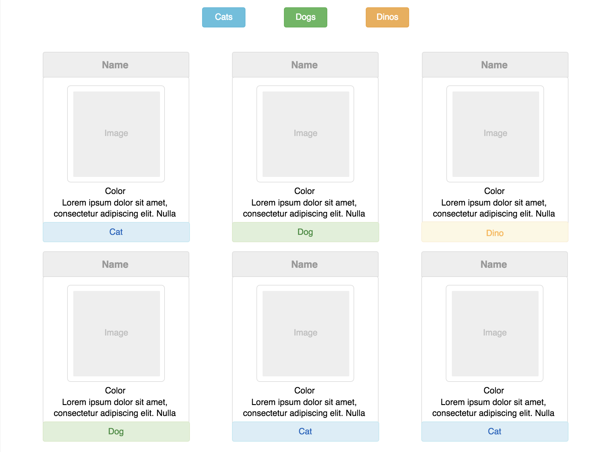

## Requirements - Loops

- As a user, I want to see a listing of all available pets. Each pet should have a card that has all this data:
```javascript
{
  "image": xxx
  "name": xxx
  "color": xxx
  "specialSkill": xxx
  "typeOfPet": xxx
}
```
- Loop through each object and print each item to the DOM


## Requirements - Event Listeners

- As a user, I want to see 3 category(type) buttons printed at the top of the page. Each should be a different color. These can be hard-coded.
- I want to be able to click one of the 3 buttons, then only the cards that are in the category(type) should show.
- There should be some way for the user to unfilter the results (ie All Pets button).



## Requirements - Readme and Loom Video
When the project is complete, make sure to follow the last step in the Planning Study Group assignment you had. Update the README with all the items listed.
